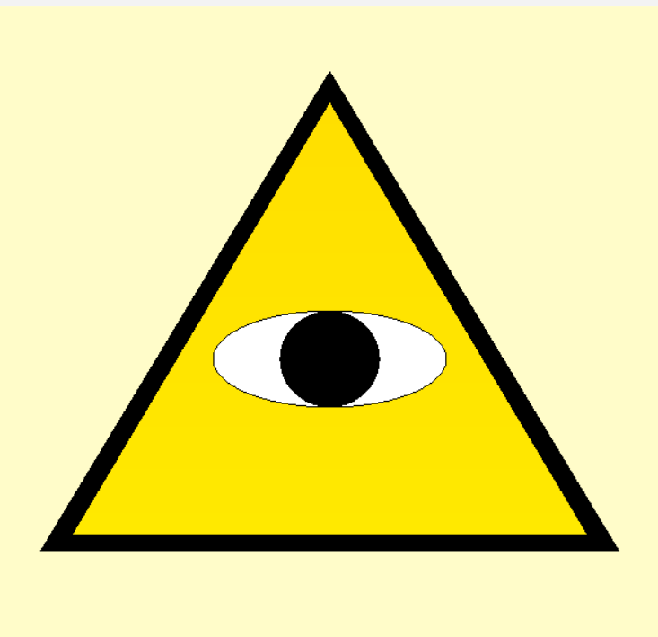

# :art: OpenGL Examples

## :book: Proje Hakkında

Bu depo, **C++** programlama dili kullanılarak **OpenGL** grafik kütüphanesiyle geliştirilmiş grafik uygulamalarını ve örneklerini içermektedir.

Projeler, herhangi bir harici kütüphaneye (GLUT, GLFW gibi) bağımlı kalmadan, doğrudan Windows API (<windows.h>) ve Temel OpenGL (<gl/gl.h>) kullanılarak saf C++ ile yazılmıştır.

## :hammer_and_wrench: Gereksinimler  

- **C++ Derleyici**: GCC veya uyumlu bir derleyici  
- **IDE**: Proje dosyaları **Dev-C++ (Embarcadero)** ile hazırlanmıştır  
- **Kütüphaneler**:  
  - `windows.h`  
  - `gl/gl.h` (OpenGL)  
  - `math.h`  

> Not: Windows sisteminde bu kütüphaneler hazır gelir, ek yükleme gerekmez.

## :file_folder: Projeler

Bu repo içerisindeki her bir klasör, farklı bir OpenGL projesini içermektedir.

| Proje | Açıklama | Önizleme |
|-------|----------|--------------|
| :triangular_flag_on_post: TÜRK BAYRAĞI | Türk bayrağının resmi ölçülerine göre OpenGL ile çizimi. Ayrıntılı [rapor](TURK-BAYRAGI/Rapor.pdf) eklidir.|  |
| :triangular_flag_on_post: ÇEK BAYRAĞI | Çek bayrağının resmi ölçülerine göre OpenGL ile çizimi. |  |
| :heart: KALP | Matematiksel denklemler kullanılarak kalp şeklinin çizimi. |  |
| :small_red_triangle: ULLIMINATI | "Illuminati" simgesinin çizimi |  |
| :star: YILDIZ | Yıldız şeklinin OpenGL ile çizimi |  |
| :chart_with_upwards_trend: HIPERBOL | Hiperbol fonksiyonunun koordinat düzleminde görselleştirilmesi. |  |
| :chart_with_downwards_trend: PARABOL | Parabol fonksiyonunun koordinat düzleminde görselleştirilmesi. |  |